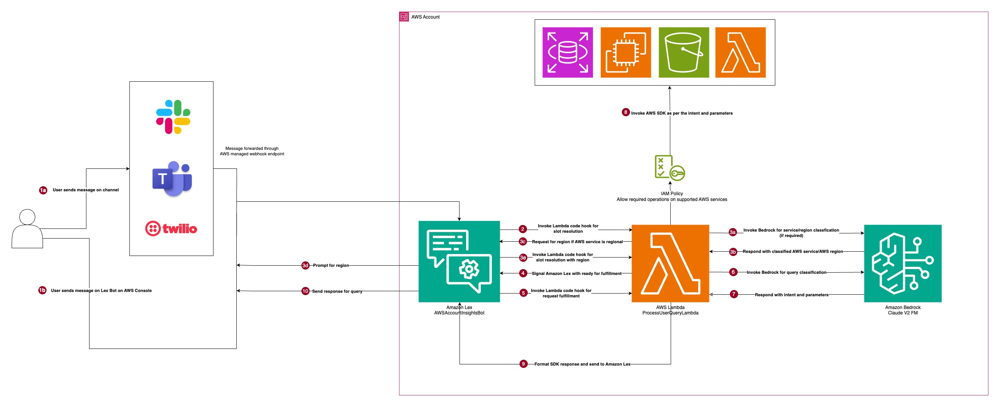

# AWS Lambda Lex Account Assistant

- [Purpose](#-purpose)
- [Key Capabilities](#-key-capabilities)
- [Tech Stack](#-tech-stack)
- [Architecture Overview](#-architecture-overview)
- [How It Works](#-how-it-works)
- [Deployment Steps (Using AWS CDK)](#-deployment-steps-using-aws-cdk)
- [Optional: Slack Integration with Amazon Lex](#-optional-slack-integration-with-amazon-lex)


## Purpose

The purpose of this solution is to provide quick and meaningful insights into AWS account information in response to simple yet important user queries—without requiring a login to the AWS Management Console or the use of CLI commands. It is especially useful for:
- Team members or developers who are awaiting AWS access or have limited permissions
- Users who are unfamiliar with navigating the AWS Console
- Organizations that wish to share selective account data without granting full access

By offering a conversational interface, this solution enables teams to obtain the information they need while maintaining control over sensitive access, enhancing both productivity and security.

## Key Capabilities

1. <b>Conversational Querying of AWS Services</b>
Enable users to ask natural language questions about core AWS services such as EC2, Lambda, S3, and RDS. Whether it’s retrieving instance counts, bucket names, function statuses, or database metadata, the system responds with relevant, actionable insights—without requiring console access or CLI usage.

2. <b>Smart Interpretation of User Intent with Claude v2 (via Amazon Bedrock)</b>
Leverage the power of Claude v2 through Amazon Bedrock to accurately understand user intent, even from vague or imprecise prompts. This allows non-technical users to interact with AWS resources using everyday language, improving accessibility and reducing the learning curve.

3. <b>Infrastructure as Code with AWS CDK</b>
The solution is deployed using the AWS Cloud Development Kit (CDK), ensuring reproducible, scalable, and version-controlled infrastructure. This IaC approach enables seamless updates, consistent environments, and easier management across teams.

4. <b>Fine-Grained Permission Control</b>
Follows the principle of least privilege by granting only the minimal set of AWS IAM permissions required to respond to each type of query. This enhances security and ensures that even in a conversational model, access remains tightly controlled and auditable.

5. <b>Session Context and Slot Management for Flexible Dialogs</b>
Maintains multi-turn conversations with users by preserving session context and intelligently managing slot-filling. This allows for dynamic, follow-up queries such as “What about us-east-1?” or “Show me just the running instances,” enabling more natural and efficient interactions.

## Tech Stack

This solution leverages a modern, serverless, and AI-powered AWS-native stack:

### Amazon Lex
- Provides the conversational interface
- Handles intent recognition, slot extraction, and dialogue flow


### Amazon Bedrock (Claude v2)
- Powers natural language understanding using Claude v2
- Translates user queries into structured JSON for service dispatch

### AWS Lambda
- Executes logic for slot resolution and fulfillment
- Maintaining session context and storing user transcripts across turns
- Routing requests to the correct AWS service via a dispatcher module
- Integrates with Bedrock and AWS services via Python (boto3)

### boto3 (AWS SDK for Python)
- Queries AWS services like EC2, Lambda, S3, and RDS
- Used inside Lambda with least-privilege IAM permissions

### AWS CDK
- Manages deployment using Infrastructure as Code
- Defines Lex bots, Lambda functions, IAM roles, and policies

### AWS IAM
- Enforces scoped, minimal-access permissions for Lambda and Bedrock
- Ensures secure and controlled resource access

### Amazon CloudWatch
- Enables logging, monitoring, and debugging of Lambda executions

## Architecture Overview

The diagram below illustrates the high-level architecture and flow of the system and provides a visual reference for how user input moves through Amazon Lex, AWS Lambda, Amazon Bedrock to retrieve and return response.




## How It Works

This solution uses Amazon Lex, AWS Lambda, and Claude v2 (via Amazon Bedrock) to interpret user queries, resolve intent, and return AWS insights. Below is a step-by-step breakdown of the workflow:

### 1. User Talks to Lex

The interaction begins when a user sends a natural language request, such as:

> <b>List my Lambda functions in us-east-1</b>

Amazon Lex is configured with:
- Intents (e.g., AskAwsAccountInsight)
- Slots (e.g., Service, Region)
- Utterances (natural language variations)

Lex uses this configuration to identify the user’s intent and extract as many slot values as possible from the initial input.

### 2. Slot Resolution Logic (`DialogCodeHook`)

If not all required slot values are provided, Lex invokes the backend Lambda function with the following invocation source in event:

`invocationSource = DialogCodeHook`. 

This Lambda function performs intelligent slot resolution using the following steps when the above invocation source type is received:

- <b>Classifies the AWS Service</b> using <b>Claude v2</b> if the `Service` slot is ambiguous or missing.
- <b>Determines if a Region is needed</b> for the identified service (e.g., `Lambda` requires a region, `S3` may not).
- <b>Prompts the user</b> for any missing slot values with tailored follow-up questions like:
    ><b>"Which region should I check for that service?"</b>
- <b>Preserves conversation context</b>, including the full user transcript, across multiple turns using Lex session attributes.

This logic ensures a seamless and natural dialog flow, even when the initial user input is incomplete or vague.

### 3. Fulfillment Logic (`FulfillmentCodeHook`)

Once all required slots are filled, Lex invokes the Lambda function again, this time with `invocationSource = FulfillmentCodeHook`. Here’s what happens:

- The Lambda retrieves the <b>original user query</b> and slot values from session attributes.
- It constructs a structured <b>prompt</b> and sends it to <b>Claude v2</b> via <b>Amazon Bedrock</b> to extract intent and parameters.
- Claude v2 returns a clean <b>JSON object</b>, for example:
    ```json
    {
        "service": "Lambda",
        "action": "list",
        "region": "us-east-1",
        "resource": "my-test-function"
    }
- This JSON is parsed and passed to the <b>dispatcher module</b>, which routes the request to the appropriate AWS service handler.
The `cdk.json` file tells the CDK Toolkit how to execute your app.

### 4. AWS Service Dispatcher

The dispatcher acts as a router, calling the appropriate boto3-based service function based on the parsed intent. Examples include:

- <b>Lambda</b>: List, invoke, or describe functions
- <b>EC2</b>: Describe running or stopped instances
- <b>S3</b>: List buckets or objects within a bucket
- <b>RDS</b>: Retrieve DB instance metadata

Each service handler uses IAM <b>fine-grained permissions</b>, scoped to perform only the actions necessary for the current request, ensuring secure and controlled access to AWS resources.

### 5. Response Sent Back to User

After retrieving response from AWS SDK, the Lambda function:

- <b>Formats the response</b> in plain, user-friendly language
- <b>Returns it to Lex</b>, which then speaks or displays the message to the user

For example:

> <b>“You have 3 Lambda functions in us-east-1.”</b>

## Deployment Steps (Using AWS CDK)
This section outlines how to set up and deploy the conversational AWS insights bot using AWS Cloud Development Kit (CDK).

### Prerequisites
Before you begin, ensure the following tools are installed and configured:


- **AWS CLI** with credentials configured (`aws configure`)
- **Python 3.8+**
- **Node.js 14.x or later**
- **AWS CDK v2** (Install via: `npm install -g aws-cdk`)
- AWS account access with permission to deploy:
  - Amazon Lex V2
  - Lambda
  - IAM
  - Bedrock (Claude access)
  - CloudWatch

> **Important:**  
> Ensure that **Claude v2 access is enabled in Amazon Bedrock**  
> for the **same region** where you are deploying this stack.  
>  
> You can enable it via the [Amazon Bedrock Console](https://console.aws.amazon.com/bedrock/home).
> AWS Documentation to add access to foundational model is [here](https://docs.aws.amazon.com/bedrock/latest/userguide/model-access-modify.html).
> Claude is available only in select regions and may require access request approval.

### Step 1: Fork and Clone the Repository

1. **Fork** this repository to your own GitHub account by clicking the **Fork** button on the top right of the repo page.

2. **Clone** your fork locally:

```bash
git clone https://github.com/your-username/aws-conversational-insights.git
cd aws-conversational-insights
```

### Step 2: Configure AWS Credentials for Deployment
Before deploying, verify that your AWS CLI is configured with credentials for the correct AWS account:

```bash
aws sts get-caller-identity
```

This command returns the AWS account ID and user/role ARN currently configured. Confirm that this matches the target deployment account.

### Step 3: Bootstrap CDK (Required For First Time Deployment)
```bash
cdk bootstrap
```
This sets up necessary infrastructure for CDK to deploy resources.

### Step 4: Deploy the Stack
```bash
cdk deploy
```
This will:
- Package and deploy your Lambda functions
- Create the Amazon Lex V2 bot with intents and slots
- Assign necessary IAM permissions

### Step 5: Test the Bot
1. Open Amazon Lex in AWS Console and select the appropriate Region (where the bot is deployed)
2. In the Bots list, click on bot `AWSAccountInsightsBot`
3. In the left sidebar, click Bot versions and choose the latest non-Draft version (e.g., Version 1).
4. Under the selected version, go to All languages > English (US) > Intents
5. Confirm that you’re viewing Version 1 (or your latest published version), not Draft
6. At the top-right, click <b>Test</b>
7. In the opened window, choose the <b>Prod</b> alias
8. Start chatting by typing your query into the chatbot

Example prompt:
> <b>List my Lambda functions in us-east-1</b>

#### Tip
Click on the `Refresh` icon on the chat box if you want to start a new session.

### Step 6: (Optional) Integrate with Slack
If you want to expose the bot via Slack, follow the manual Slack integration steps.
AWS documentation on integrating Amazon Lex V2 bot with Slack can be found [here](https://docs.aws.amazon.com/lexv2/latest/dg/deploy-slack.html)

#### Note on Amazon Lex Channel Integrations: Key Constraints
1. <b>No Programmatic Support for Channel Integration</b> - Amazon Lex does not support creating channel integrations (like Slack, Facebook, Twilio) via: AWS CLI, AWS SDKs, AWS CloudFormation, CDK. You must set up channel integrations manually through the Lex V2 Console.

2. Slack Bot App Must Be Created Manually (Outside AWS)

### Step 7: Cleanup
To remove all resources created:
```bash
cdk destroy
```
